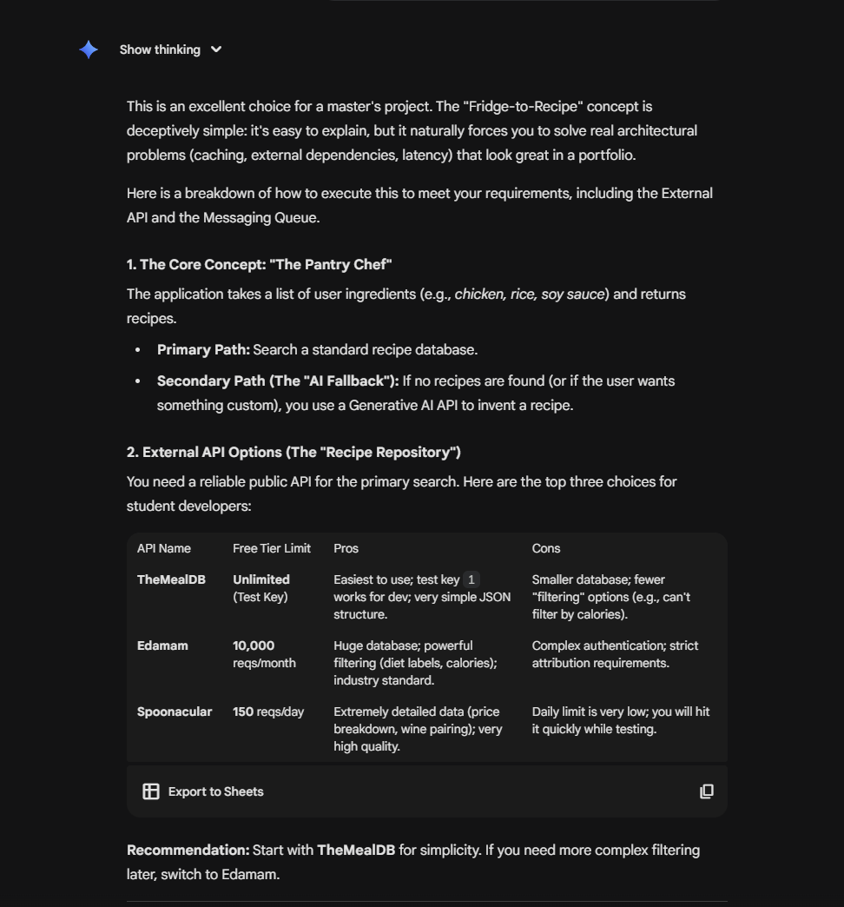

# AI Usage documentation

This document tracks my usage of AI as per the course policy to remain transparant about my usage of AI

## Brainstorming

I used Gemini for brainstorming a project idea. I'm thinking about a project that can utilize ingredients to connect me with a recipe that I can use it for. I'm keeping the prompt simple to get the system architecture first. The goal is to identify the APIs that I can use, and how I may be able to bake in some messaging (A project requirement).

Prompt
```
I am working on a class project for my masters program. The project will be to build a web application with a functional front end, backend, data base, and some messaging queues. I am brainstorming some ideas for a project. My current thought process is a simple application that can take in a a list of raw ingredients that I may have around and have it generate recipes. Part of the class requirement would be to utilize an external API. I'm thinking that I can utilize any existing recipe repository APIs. If none is known to exist or is not publicly available, my fallback may be to utilize openrouter to converse with an API to come up wit the recipe
```


Based on the brainstorming content, I have a few API options researched for me. I will likely choose TheMealDB for my MVP since it is free and unlimited.
In order to satisfy the messaging queue requirement, I plan to also utilize the message broker to collect the response from an AI while loading the options from TheMealDB. Because the meal likely has limitations to the recipe it will provide, having a back up AI generated response may be useful. Even if the response is returned by the meal DB, I can still propose an additional suggestion.

## Misc

### 1/23/2026 - Setting up gitignore
I am not familiar with Python, so I asked Cline whether it makes sense to commit and push my venv folder content and any folder named __pycache__. It suggested I do not do that and helped me to setup the gitignore file.